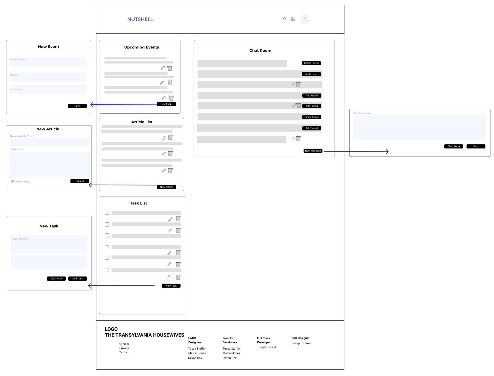
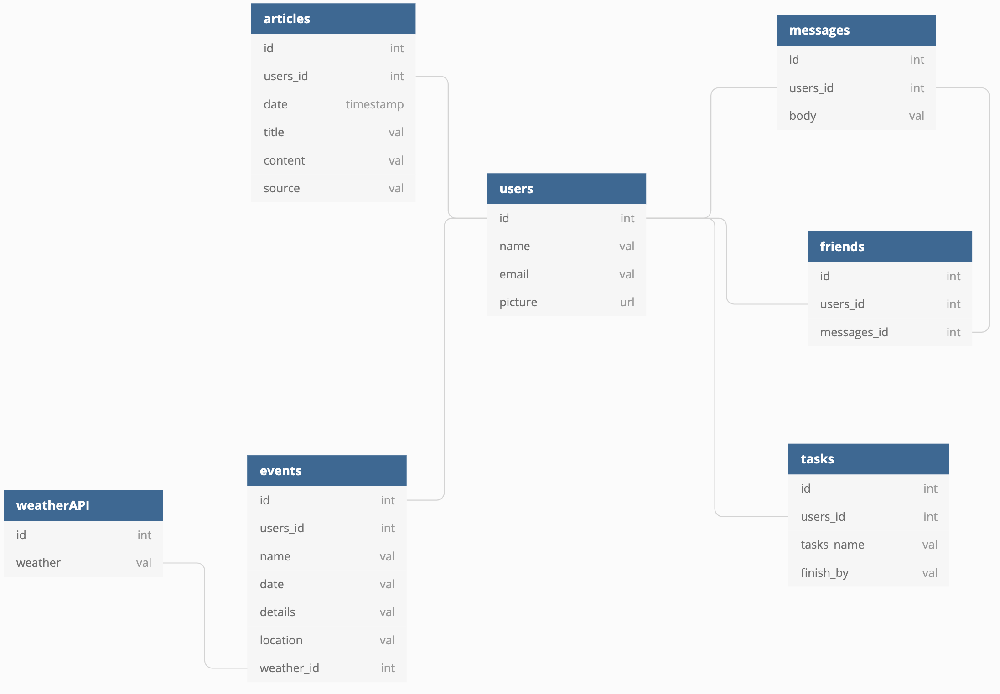

# Nutshell: The Information Dashboard by The Real Transylvania Housewives

## Overview

Nutshell is a a dashboard for people to use to organize their daily tasks, events, news article, friends, and chat messages.

## Target Audience
Expectant mummies (the scary, mumified ones). Happy Halloween!

## Learning Objectives

1. Functions
2. Databases
3. Github
4. Objects
5. CSS/Flexbox
6. Array methods
7. Components
8. Handling user events
9. Implementing CRUD operations
10. Relational data
11. ERDs

## Planning Tools

1. Login Wireframe 
2. Wireframe 
3. ERD 

## Instructions for Running Nutshell
Make sure you have Node.js and npm installed. After those are installed, make sure you use npm to install serve and json-server.

1. git clone the repository URL
2. cd into the directory it creates
3. touch api/database.json
4. Delete the .ignore file in the api directory
5. touch src/scripts/Settings.js
6. In your database.json file, copy and paste the following code:
{ "users": [], "tasks": [], "events": [], "news": [], "messages": [], "friends": [] }
7. Serve JSON file utilizing json-server -w database.json -p 8088
8. In a new tab in your terminal, cd into src, and serve
9. Go to the localhost address in your browser that serve is serving on and register an account

## Team: The Real Transylvania Housewives

- [Devon Cox](https://github.com/Devco2011)
- [Joseph Tidwell](https://github.com/joetid09)
- [Marcel Jones](https://github.com/marceljones)
- [Tessa Steffen](https://github.com/TessaSoftEng)

